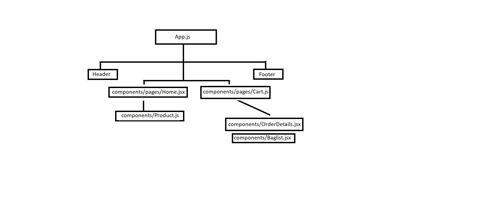

# Redux Shopping Cart

This project aims to create a home page and cart page where users can manage price cards with per-item price, per-item quantity, total quantity, and total amount in the cart using Redux for state management.

## Introduction

This project utilizes Redux to efficiently manage state and perform necessary operations on the price card management page. Users can add, update, delete  cards, and see the total quantity and amount dynamically updated based on the per-item quantity and price.

### Demo

Explore the demo of this project: [Shopping Cart](https://statuesque-stardust-a69be8.netlify.app/)

## Features
- Add and Delete the product to the cart from the Home page.
- In the cart page, view the added product details and also remove the product.
- Also update per-item price and quantity.
- Dynamically update total quantity and total amount based on per-item quantity and price changes.

## React Routes

Routes:  
- Home Page -> Menu UI 
- Cart Page -> Wishlist(heart) UI

## File structure 

## Setup

To run this project, ensure you have the following installed:

- Node.js
- npm

Then, follow these steps:

1. Clone the repository.
2. Navigate to the project directory in your terminal.
3. Run `npm install` to install the project dependencies.
4. Run `npm start` to start the development server.
5. Open [http://localhost:3000](http://localhost:3000/) in your browser to view the application.